<p align="center">
  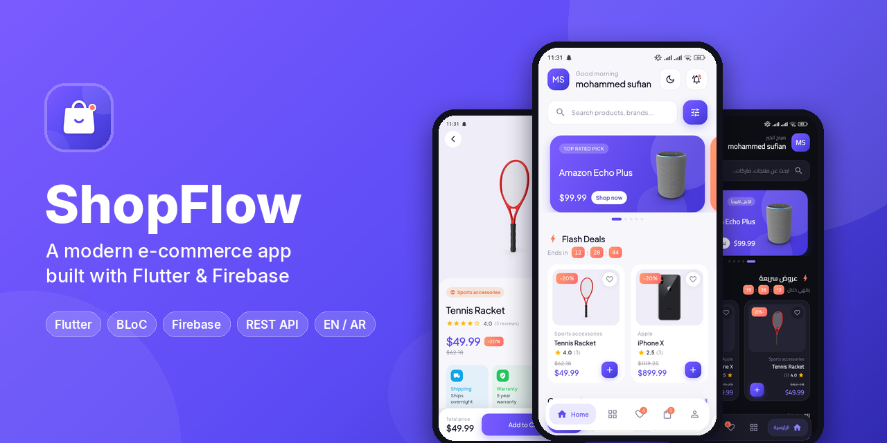
</p>

<h1 align="center">ShopFlow</h1>

<p align="center">
  A full-featured e-commerce mobile app built with <b>Flutter</b>, <b>BLoC</b> and <b>Firebase</b>,<br>
  powered by the <a href="https://dummyjson.com/docs/products">DummyJSON</a> REST API — in English and Arabic.
</p>

<p align="center">
  
  
  
  
  
</p>

<p align="center">
  <a href="#-screenshots">Screenshots</a> •
  <a href="#-features">Features</a> •
  <a href="#-tech-stack">Tech Stack</a> •
  <a href="#-architecture">Architecture</a> •
  <a href="#-getting-started">Getting Started</a>
</p>

---

## 📱 Screenshots

<table>
  <tr>
    <td align="center">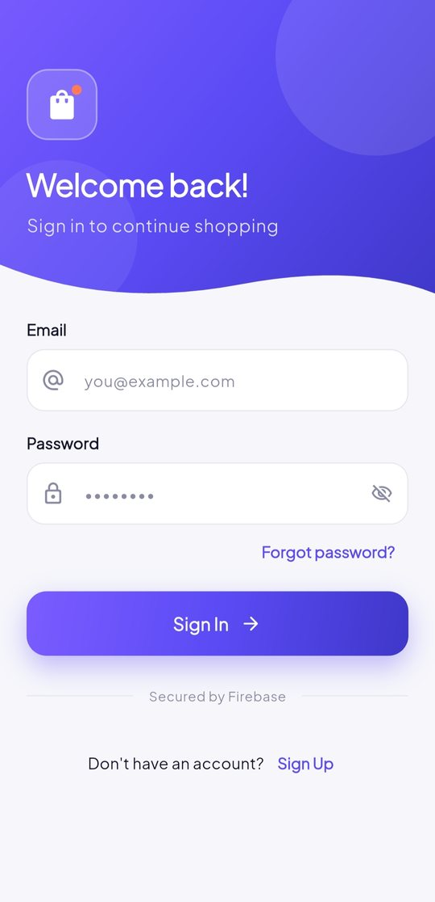<br><sub><b>Sign in</b></sub></td>
    <td align="center">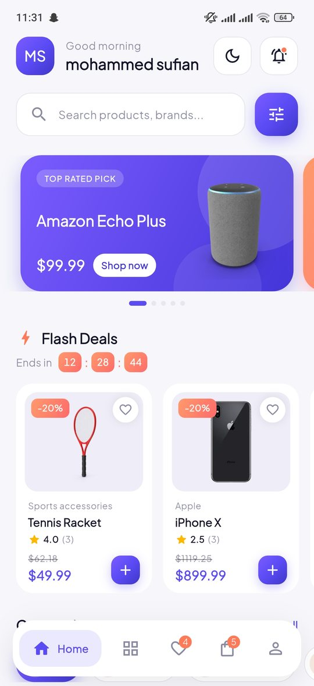<br><sub><b>Home</b></sub></td>
    <td align="center">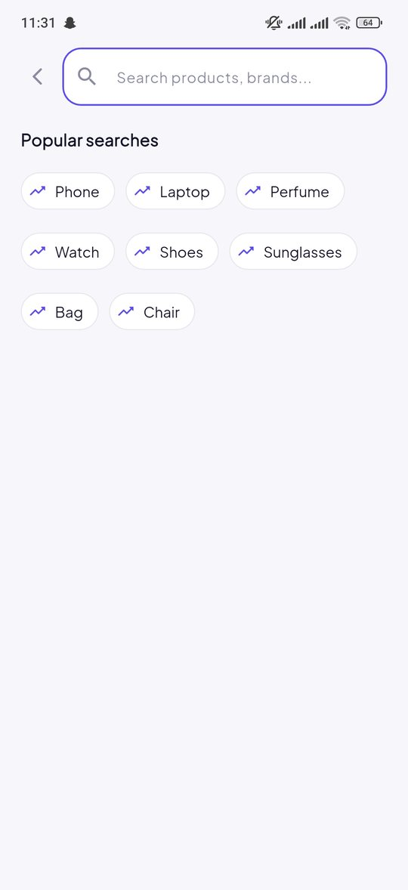<br><sub><b>Search</b></sub></td>
    <td align="center">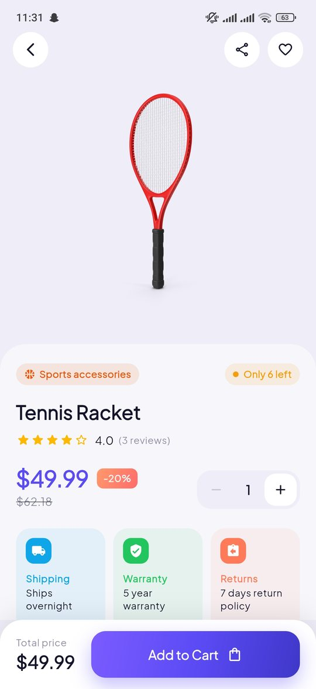<br><sub><b>Product details</b></sub></td>
  </tr>
  <tr>
    <td align="center">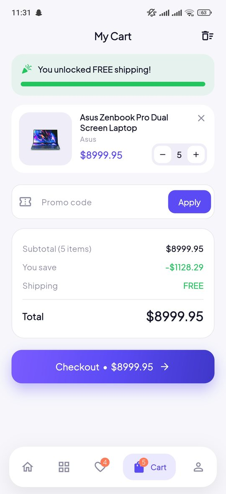<br><sub><b>Cart</b></sub></td>
    <td align="center">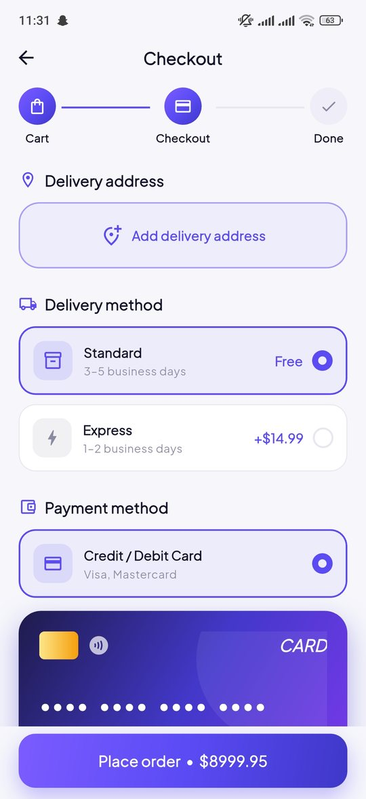<br><sub><b>Checkout</b></sub></td>
    <td align="center">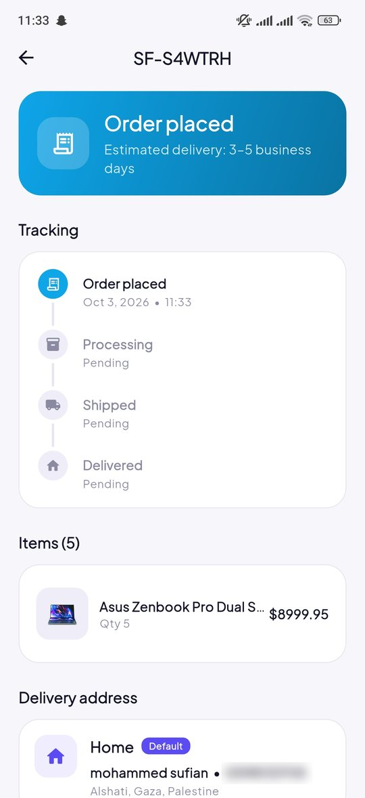<br><sub><b>Order tracking</b></sub></td>
    <td align="center">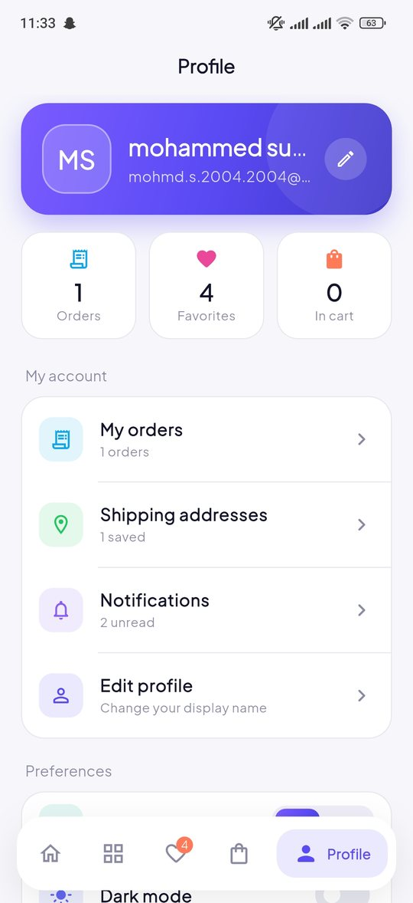<br><sub><b>Profile</b></sub></td>
  </tr>
  <tr>
    <td align="center">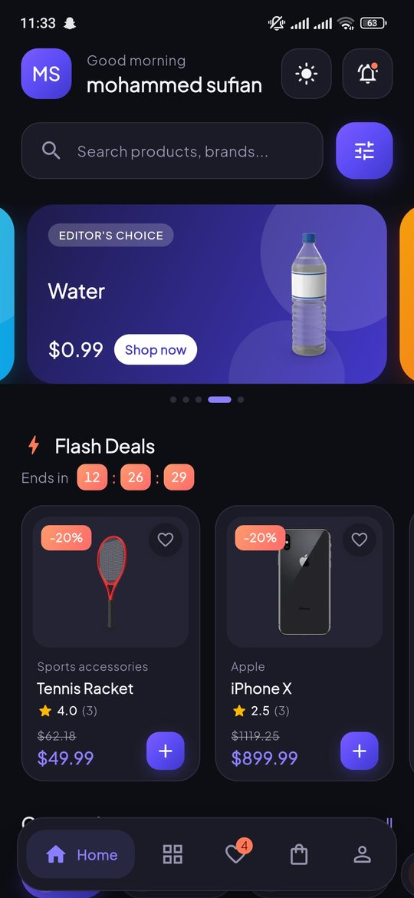<br><sub><b>Dark mode</b></sub></td>
    <td align="center">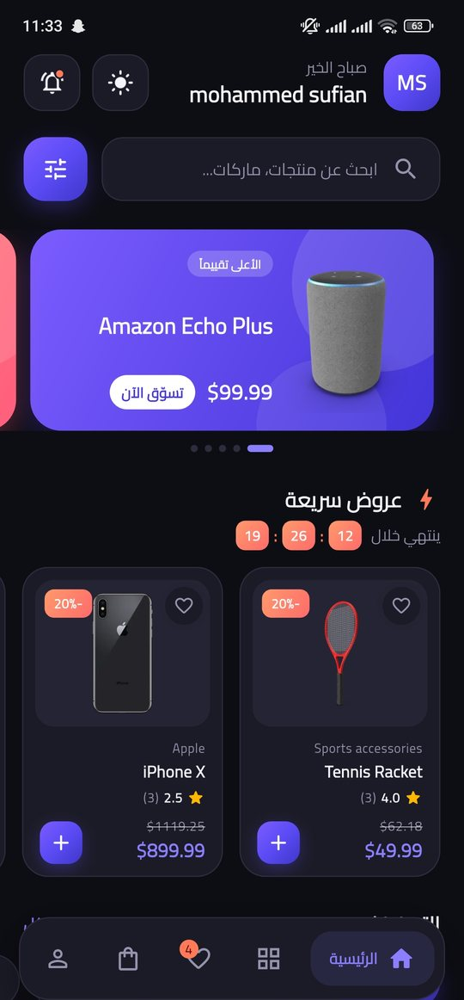<br><sub><b>Arabic (RTL)</b></sub></td>
    <td align="center">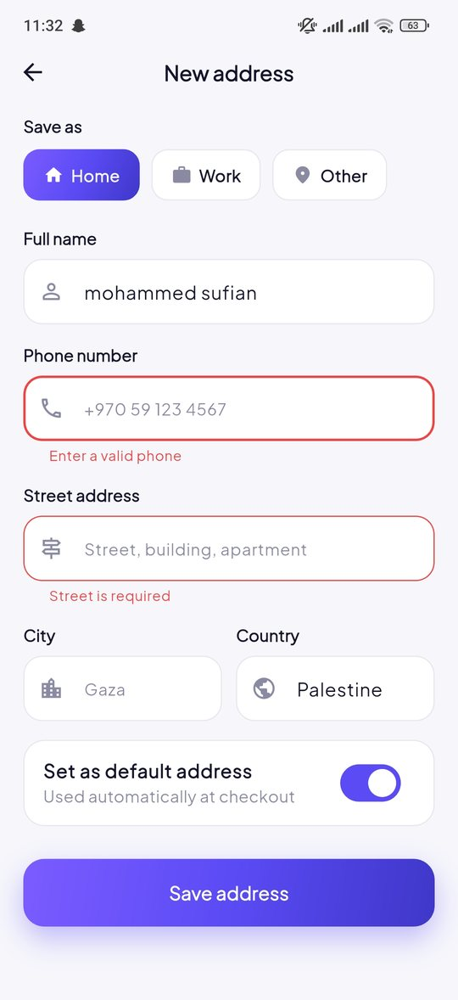<br><sub><b>Address form &amp; validation</b></sub></td>
    <td></td>
  </tr>
</table>

---

## ✨ Features

**Shopping**
- Home with promo carousel, flash deals with a live countdown, category chips and an infinite product grid
- Debounced search with recent and popular searches, sorting, price-range and rating filters
- Product details with image gallery and zoom, stock status, reviews summary and related products
- Favorites, and a cart with quantity controls, swipe-to-delete with undo, promo codes and a free-shipping progress bar

**Checkout & orders** *(demo — no real payment)*
- Saved addresses with a default address, standard / express delivery and a live card preview
- Order confirmation, order history and a status timeline that advances automatically
- Local push notifications and an in-app inbox for order updates and offers

**Account & experience**
- Firebase email/password authentication with sign-up, sign-in and password reset
- Cart, favorites, addresses and orders synced per user with Cloud Firestore (works offline first)
- English and Arabic with full right-to-left layout, plus light and dark themes
- Shimmer loading states, empty and error states, and smooth animations throughout

---

## 🛠 Tech Stack

| Area | Packages |
|---|---|
| State management | `flutter_bloc`, `equatable` |
| Networking | `dio` (DummyJSON REST API) |
| Backend | `firebase_core`, `firebase_auth`, `cloud_firestore` |
| Local storage | `shared_preferences` |
| Notifications | `flutter_local_notifications` |
| UI | `google_fonts`, `cached_network_image`, `shimmer` |
| Localization | `flutter_localizations` (English / Arabic, RTL) |

---

## 🏗 Architecture

The app follows a layered structure where the UI never talks to data sources directly:

```
UI (presentation)  →  Cubits (logic)  →  Repositories (data)  →  REST API · Firebase · Local storage
```

```
lib/
├── core/            # theme, localization, networking, services, shared widgets & utils
├── data/
│   ├── models/      # Product, CartItem, Order, Address, AppUser …
│   └── repositories/# products API, auth, Firestore sync
├── logic/           # one Cubit per feature (auth, home, search, cart, orders …)
└── presentation/    # screens and widgets, one folder per feature
```

---

## 🚀 Getting Started

**Prerequisites:** Flutter SDK 3.x and a Firebase project.

```bash
# 1. Clone and install dependencies
git clone https://github.com/MohamedSufian/shop_flow_e_commerce_mobile_app.git
cd shop_flow_e_commerce_mobile_app
flutter pub get

# 2. Connect your own Firebase project (generates lib/firebase_options.dart)
flutterfire configure

# 3. Run
flutter run
```

In the Firebase console, enable **Authentication → Email/Password** and create a **Firestore Database**, then publish the rules from [`firestore.rules`](firestore.rules).

### Try it out

| | |
|---|---|
| Promo codes | `SHOP10` · `WELCOME` · `FLOW20` |
| Test card | `4242 4242 4242 4242`, any future expiry date |

---

## 👤 Author

**Mohammed Sufian Abuzanouna** — Junior Flutter Developer

[](https://github.com/MohamedSufian)
[](https://www.linkedin.com/in/mohammed-sufian-852a04435/)
[](mailto:mohmd.s.2004.2004@gmail.com)
